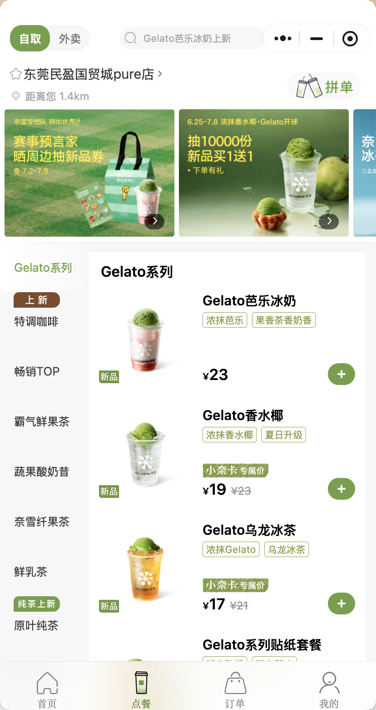
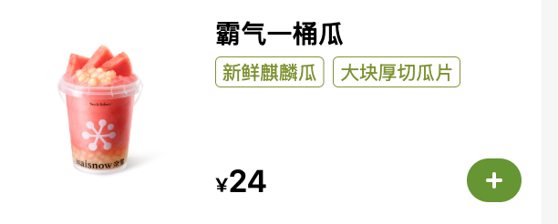
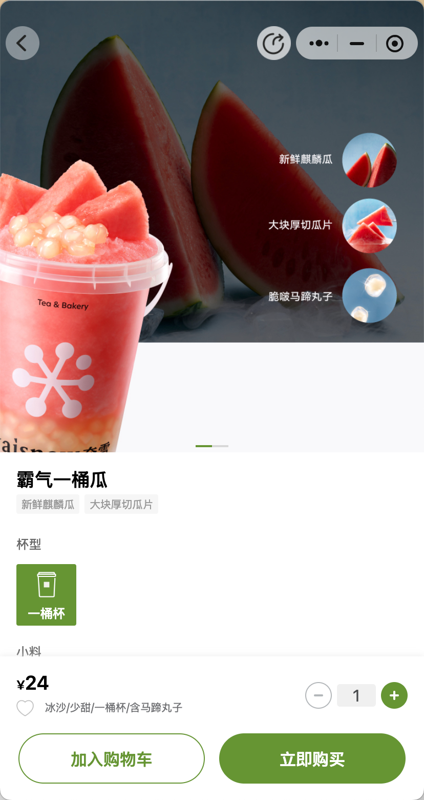
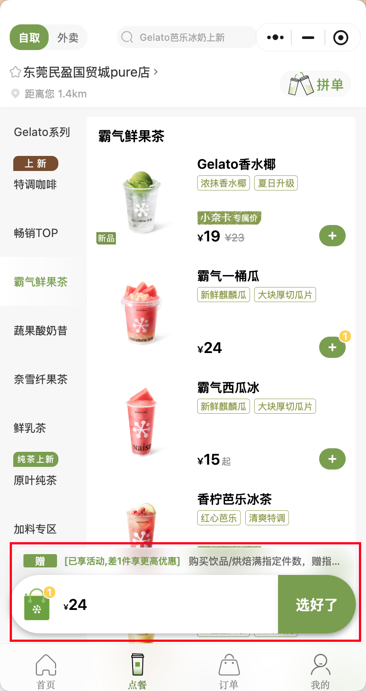
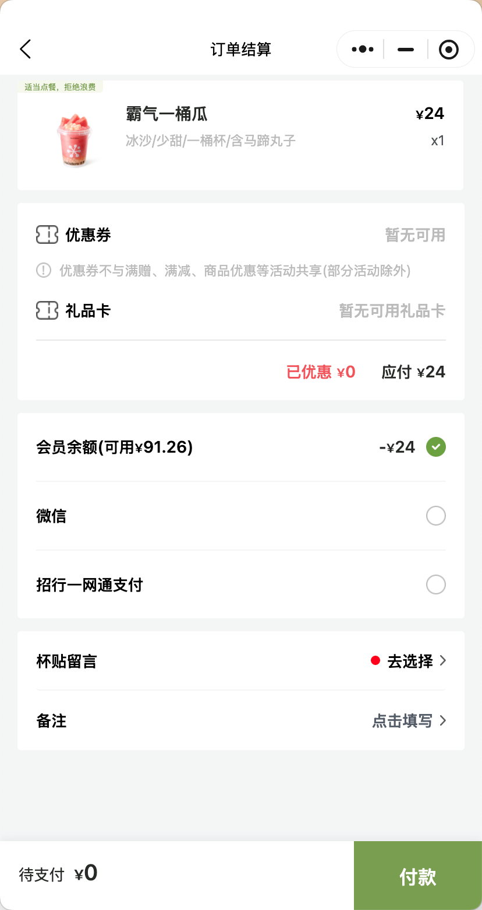
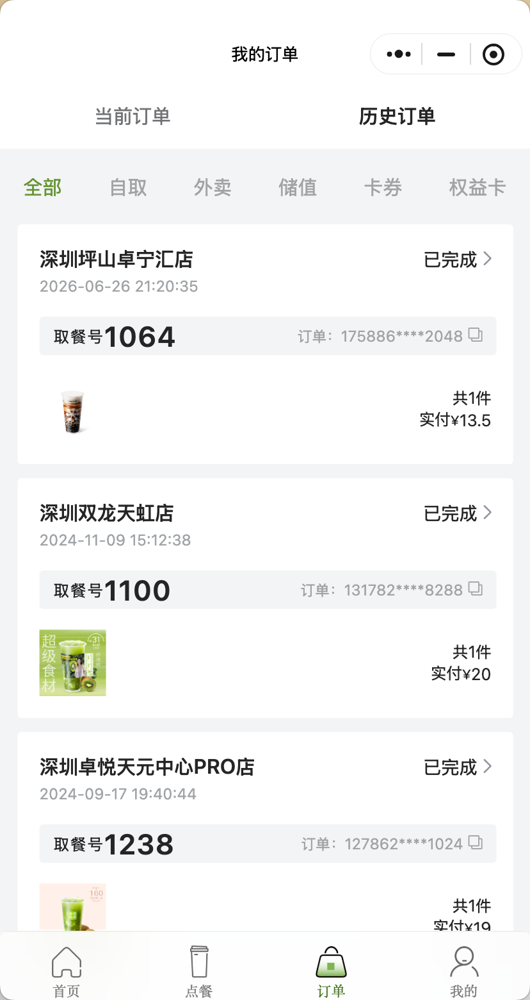

我想做一个奶茶店线上点单的微信小程序，用于满足用户的购物欲望。

功能清单：商品信息查询、详情查看（定制）、购物车、账户管理
页面结构：首页（账户信息、活动信息）、商品列表（商品信息查询）、商品详情页（商品详情&定制化点单）、购物车列表、订单列表

详细描述：
页面通过下方 tab 切换，tab 页顺序：首页、点单、订单
1、用户进入微信小程序后，显示主页

主页由两部分组成，上方是横向滑动图片，用于展示商品活动信息，下方是 账户信息（账户名、积分、兑换券、余额）
2、在点单 tab，最上方是商品搜索框，搜索框下面是横向滑动图片用户展示活动信息，下方是商品列表，商品列表分成左右两部分，左侧是商品分类，右侧是商品列表，商品列表，每个商品用一个卡片展示，卡片包括左侧的商品图片、右侧商品名称、标签、关键参数、价格、加购按钮

3、点击商品列表中的商品或加购按钮，进入商品详情页，商品详情页包含商品信息，最上面是商品大图，然后依次往下是名称、标签、杯型选择、小料选择、甜度选择。页面最下面pin 的是用户当前已选参数、当前商品价格、数量选择、加入购物车按钮和立即购买按钮

用户点击加入购物车，返回商品列表，底部出现购物车信息浮窗，显示商品数量、总金额、结算按钮，商品列表里该商品的加购按钮右上角有加购数量

4、用户在商品详情页点击立刻购买或在商品列表页点击结算按钮，进入订单结算页，显示所有已选商品信息，商品信息包括商品图片、商品名称、各种参数、数量、价格；然后显示优惠券信息以及总金额；页面底部pin 一条长方形区域，显示待支付金额和支付按钮

5、用户点击支付按钮，根据订单信息生成订单，并弹出支付弹框，包括待支付金额，确认支付、稍后支付按钮，用户点击任意按钮后，返回订单列表。订单列表显示用户所有订单信息，每一笔订单是一个卡片，卡片里包括取餐号、订单内商品缩略图、订单金额、订单时间

机制设计：
1、 看视频获得余额
2、 积分通过账号消费获得
3、 积分用于账号升级，确定每月账号资金发放
4、 每月 15 日，系统根据用户积分等级，发放对应金额的余额：level1 50*（1±x），level2 100*（1±x），level3 150*（1±x），level4 200*（1±x），level5 300*（1±x），x 是幸运系数，先用随机数（0~0.1）
